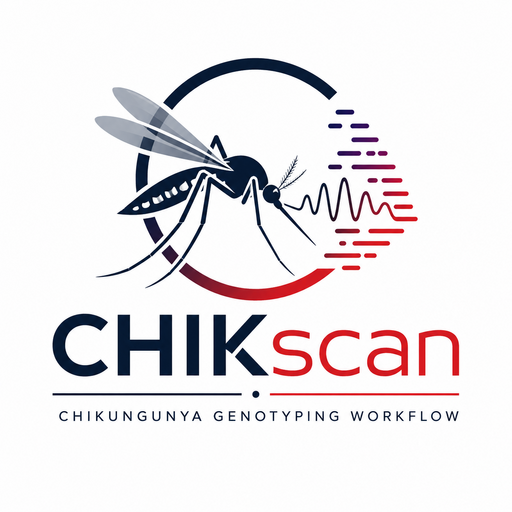

# CHIK-FLOW

CHIK-FLOW is a Nextflow DSL2 pipeline scaffold for chikungunya virus (CHIKV)
sequencing analysis. The goal is to provide a RSVrecon-level workflow for raw
FASTQ processing, coverage/depth reporting, consensus generation, genotyping,
phylogeny, and PDF/HTML reporting.

This repository currently contains the first executable foundation:

- samplesheet validation
- optional merge of multiple lanes per sample
- raw read FastQC
- fastp trimming/filtering
- post-trim FastQC
- batch MultiQC
- BWA-MEM alignment to validated CHIKV reference
- sorted/indexed BAM with basic mapping statistics
- per-base depth and basic genome coverage summary
- GFF-derived gene/CDS coverage summary
- consensus FASTA with low-depth masking
- nucleotide variant CSV table
- amino-acid mutation CSV table for CDS-overlapping variants
- per-sample CSV summary across mapping, coverage, consensus, and variants
- batch-level sample summary CSV
- nearest-reference CHIKV genotype/lineage CSV
- batch consensus distance matrix and UPGMA Newick tree
- batch HTML and PDF report
- organized per-sample output directories

## Planned Scope

- CHIKV reference selection against a curated reference panel
- reference selection and alignment to best matched reference
- per-base depth and genome/gene coverage reports
- consensus FASTA with configurable masking thresholds
- nucleotide and amino-acid variant reporting
- expanded curated CHIKV genotype reference panels
- publication-grade phylogenetic tree rendering
- richer sample-level report pages and plots

## Input

Create a CSV samplesheet:

```csv
sample,fastq_1,fastq_2
sample_1,/path/sample_1_R1.fastq.gz,/path/sample_1_R2.fastq.gz
sample_2,/path/sample_2_R1.fastq.gz,/path/sample_2_R2.fastq.gz
```

For single-end data, leave `fastq_2` empty.

If a sample has multiple lanes, add one row per lane with the same `sample`
name. CHIK-FLOW will merge them before analysis.

## Run

```bash
nextflow run . \
  -profile docker \
  --input samplesheet.csv \
  --outdir results \
  --reference_fasta references/chikv_panel.fasta \
  --reference_gff references/chikv_panel.gff \
  --genotype_references references/chikv_genotypes.fasta
```

`--genotype_references` is optional. When omitted, CHIK-FLOW uses
`--reference_fasta` as a fallback for nearest-reference comparison. For
surveillance-grade genotype and wild/vaccine calls, provide a curated
multi-record FASTA whose headers include labels such as
`|genotype=ECSA|lineage=IOL|source=wild` or
`|genotype=Asian|lineage=vaccine-strain|source=vaccine`.
An initial curated panel is provided at
`assets/reference/chikv_genotype_references.fasta`; provenance and
interpretation notes are documented in `docs/reference_panel.md`.

Run a lightweight configuration check:

```bash
nextflow run . --help
```

Development checks and the focused Docker smoke test are documented in
`docs/development.md`.

## Outputs

Current outputs:

```text
<outdir>/
├── batch_qc/
│   └── multiqc/
├── pipeline_info/
├── reference_panel/
├── batch_reports/
└── <sample>/
    ├── fastq/
    │   └── trimmed/
    ├── bam/
    ├── assembly/
    ├── genotyping/
    ├── reference_selection/
    ├── coverage/
    ├── summary/
    ├── variant_calling/
    ├── log/
    │   └── fastp/
    └── qc/
        ├── fastp/
        └── fastqc/
            ├── post_trim/
            └── pre_trim/
```

Reference panel preparation validates FASTA records, optional GFF
seqids, and writes:

```text
reference_panel/reference.fasta
reference_panel/reference.gff
reference_panel/reference_panel.csv
reference_panel/genotype_references.fasta
reference_panel/genotype_reference_panel.csv
```

Batch reports include:

```text
batch_reports/sample_summary.csv
batch_reports/chikflow_report.html
batch_reports/chikflow_report.pdf
batch_reports/chikflow_phylogeny.svg
batch_reports/phylogeny/chikflow.alignment.fasta
batch_reports/phylogeny/chikflow.distance_matrix.csv
batch_reports/phylogeny/chikflow.phylogeny_metadata.csv
batch_reports/phylogeny/chikflow.tree.nwk
```

## Development Status

This is an executable development pipeline. Genotype and wild/vaccine source
assignment are implemented as nearest-reference comparisons and are only as
complete as the supplied curated genotype FASTA.
